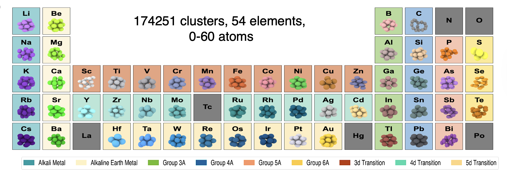

# Gaussian Approximation Potentials for Elemental Nanoclusters

<p align="center">
  
</p>

This repository contains **Gaussian Approximation Potential (GAP)** models for **54 elemental nanocluster systems** across the periodic table. For each element, the following are provided:

* GAP potential model files
* Tersoff potential files for comparison
* Performance metrics and dataset statistics
* Energy and force parity plots
* Results of dynamic stability tests
* Normal mode analysis
* Lattice parameter and cohesive energy ordering of ground state polytypes
* Comparison of energy and force errors with Tersoff models [Manna *et al.* (2022)](https://www.nature.com/articles/s41467-021-27849-6)
* Lattice parameter and cohesive energy prediction comparisons


Webpage 👉 [sbanik2.github.io/GAP-Nanoclusters/](https://sbanik2.github.io/GAP-Nanoclusters/)
---

## Dataset


The training and test datasets are made available **upon request**.

The **ground state polymorphs** of the elemental nanoclusters and a portion of the **validation dataset** are publicly accessible via the [Quantum Cluster Database (QCD)](https://muellergroup.jhu.edu/qcd/).

Additionally, all QCD configurations **relaxed using the GAP model** are provided in this repository under the `qcd_gap_relaxed/` directory.


---


## Fitting a GAP Model

To fit a **Gaussian Approximation Potential (GAP)** model, follow the steps outlined below. This section describes the process of fitting a GAP model using the provided scripts in this repository.

#### 1. Prerequisites

Before fitting the GAP model, ensure that the **QUIP package** ([QUIP Documentation](https://libatoms.github.io/QUIP/)) and **GAP fitting utilities** are compiled and installed on the system. The GAP fitting script requires the QUIP package with the `gap_fit` utility.

#### 2. Example Workflow for Fitting a GAP Model

Navigate to the `fit_a_model` path within the repository. This directory contains all the necessary files to fit a GAP model for an elemental system (e.g., Ag).

In the `fit_a_model` directory, the file `gap-fit.py` contains the necessary code to fit a GAP model using the training and test data provided in the directory.

#### 3. Input Files and Directory Structure

To run the model fitting process, the following files must be provided in the directory:

* **`train.xyz`**: Training data file containing atomic configurations and energies.
* **`test.xyz`**: Test data file for validation.
* **`ground_state.xyz`**: Ground-state structure file for energy calculations.
* **`param.txt`**: A file containing the fitting parameters (see below for details).

The directory also contains additional scripts for performing calculations and analysis:

* **`calculator.py`**: Script for performing calculations during the fitting process.
* **`final_calculation.py`**: Script for additional analysis after fitting the model.

#### 4. `param.txt` File Structure

The `param.txt` file contains the following comma-separated values:

```
4.75, 0.005, 0.0001, 5
```

##### Parameter Breakdown:

1. **Cutoff (`4.75`)**: Defines the **cutoff distance** for atomic interactions in the SOAP kernel.
2. **`sigma_energy` for Cluster (`0.005`)**: Controls the **regularization** corresponding to energy for the **cluster modality**.
3. **`sigma_energy` for Bulk (`0.0001`)**: Controls the **regularization** corresponding to energy for the **bulk modality**.
4. **Scaling Factor (`5`)**: This is the **multiplication factor** for **sigma\_force**. The relationship is:
   `sigma_force = Scaling factor * sigma_energy` for a given modality.

The `param.txt` for all the elements used for fitting is provided in the `fit_a_model/All_parameters` directory.

These values are used in the **`gap-fit.py`** script to define the fitting parameters. The **cutoff** and **sigma values** are applied based on the **modalities** (`cluster`, `bulk`) for energy and force predictions.

#### 5. Running the GAP Fitting Script

Run the fitting script `gap-fit.py` to fit the GAP model using the provided training and test data:

```bash
python gap-fit.py
```

#### 6. Output Files

Once the script runs successfully, it will generate the following files in the directory:

* **`gap_model.xml`**: The output GAP model file generated from the fitting process.
* **`E_pred.json`**: A JSON file containing the predicted energy values from the fitted GAP model.
* **`F_pred.json`**: A JSON file containing the predicted forces from the fitted GAP model.
* **`lattice_GS.json`**: A JSON file containing the lattice parameters and cohesive energy for the ground-state structures.

#### 7. Additional Analysis

After the model fitting, further analysis can be performed using the provided **`Analysis.ipynb`** notebook. This notebook is designed to help analyze the predicted values, including energy, force, and lattice parameters, and visualize the results.


---
## Usage

### Relaxing Structures with GAP

This example demonstrates how to relax a nanocluster structure using a trained **Gaussian Approximation Potential (GAP)** model via the **[QUIP](https://libatoms.github.io/QUIP/)** interface and **[ASE (Atomic Simulation Environment)](https://wiki.fysik.dtu.dk/ase/)**.

The script below performs a geometry optimization (relaxation) on a single `.xyz` structure using the GAP model:

```python
from ase.io import read, write
from ase.optimize import BFGS
from quippy.potential import Potential

# --- Settings ---
element = "Ag"  # Replace with your element symbol
structure_path = f"{element}_structure.xyz"  # Input structure file
gap_file = f"./gap_files/{element}.xml"      # Path to the GAP model file

# --- Read structure ---
atoms = read(structure_path)

# --- Assign GAP calculator ---
gap_calc = Potential(param_filename=gap_file)
atoms.calc = gap_calc

# --- Relaxation using BFGS optimizer ---
optimizer = BFGS(atoms, logfile=None)
optimizer.run(fmax=0.001, steps=500)

# --- Output results ---
relaxed_energy = atoms.get_potential_energy()
print(f"Relaxed GAP energy: {relaxed_energy:.6f} eV")
```

### 📌 Requirements

* `ase`
* `quippy` (install via QUIP or conda build of `libatoms`)

Absolutely. Here's a generalized version of the **LAMMPS input script** with a clean format for a general audience, suitable for placing in your `README.md` under the LAMMPS usage section:

---

### Using GAP with LAMMPS

To perform structure relaxation with a GAP model in LAMMPS, use the following template. Ensure your **[LAMMPS](https://www.lammps.org/#gsc.tab=0)**  build includes the **QUIP interface**.

```lammps
dimension       3
units           metal
boundary        f f f
atom_style      atomic    

read_data       structure.geo   # Replace with your LAMMPS data file


pair_style      quip
pair_coeff      * * path/to/your_gap_model.xml "Potential xml_label=Your_Label" atomic_number

neighbor        2.0 bin
neigh_modify    every 2 delay 0 check no

# Minimization
minimize        1.0e-10 1.0e-10 10000 10000

write_data      relaxed_structure.data
```


---

### Using Tersoff-HyBOP Potentials in LAMMPS

The Tersoff-HyBOP model used here consists of **two components**:

* A **Tersoff-style (BOP-like)** three-body interaction potential
* A **Lennard-Jones (LJ) scaling** component for long-range dispersion interactions

All model parameters are stored in individual `.json` files per element . Each file includes:

* A `tersoff` section with named Tersoff parameters
* A `scaling` section with `epsilon`, `sigma`, `k1`, `k2`, and `RcLR` used in `lj/cut/scaling`

To convert these `.json` files into **LAMMPS-ready inputs**, use the Jupyter notebook:

> 📓 `tersoff_lammps_template.ipynb`

This notebook automates:

* Generating the `.tersoff` file used with `pair_style tersoff`
* Writing a matching `LAMMPS input script (.in)` that uses `hybrid/overlay` with `tersoff` and `lj/cut/scaling` styles.

---

####  LAMMPS Setup example:

```lammps
pair_style hybrid/overlay tersoff lj/cut/scaling 14
pair_coeff * * tersoff Ag.tersoff Ag
pair_coeff 1 1 lj/cut/scaling epsilon sigma k1 k2 RcLR
```

Make sure to replace the last line with the actual values, which are automatically extracted by the script.

---

## 📖 Citation

Please cite the following if you use this repository, or models:

###  To cite the **GAP models** for elemental nanoclusters:

```bibtex
@article{banik2024generalized,
  title     = {Generalized Machine Learning Potential Models for Elemental Nanoclusters},
  author    = {Banik, Suvo and Aggarwal, Abhishek and Manna, Sukriti and Dutta, Partha Sarathi and Sankaranarayanan, Subramanian KRS},
  journal   = ,
  year      = {2024}
}
```


###  To cite the **Tersoff-HyBOP models**:

```bibtex
@article{manna2022learning,
  title     = {Learning in continuous action space for developing high dimensional potential energy models},
  author    = {Manna, Sukriti and Loeffler, Troy D and Batra, Rohit and Banik, Suvo and Chan, Henry and Varughese, Bilvin and Sasikumar, Kiran and Sternberg, Michael and Peterka, Tom and Cherukara, Mathew J and others},
  journal   = {Nature Communications},
  volume    = {13},
  number    = {1},
  pages     = {368},
  year      = {2022},
  publisher = {Nature Publishing Group UK London},
  doi       = {10.1038/s41467-021-27885-0}
}
```

---


