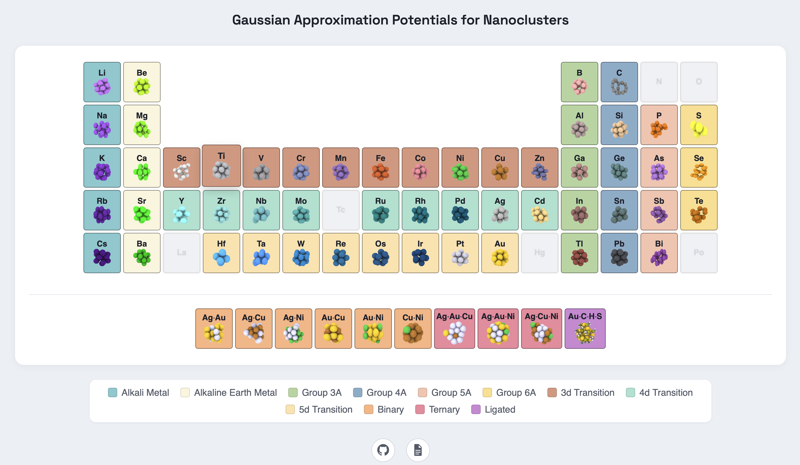

# Gaussian Approximation Potentials for Elemental Nanoclusters

<p align="center">
  
</p>

This repository contains **Gaussian Approximation Potential (GAP)** models for **54 elemental nanocluster systems** across the periodic table, trained on a dataset of over 234K nanocluster configurations. It also includes GAP models for **6 binary** and **3 ternary alloy nanoclusters** (~8K and ~4K configurations respectively), and a **quaternary ligated Au–C–H–S system**. These models accompany the paper *"Generalized Machine Learning Potential Models for Elemental Nanoclusters."*

For each system, the following are provided:

* GAP potential model files
* Performance metrics and dataset statistics
* Energy and force parity plots
* Results of dynamic stability tests
* Normal mode analysis (single-element systems)
* Lattice parameter and cohesive energy ordering of ground state polytypes (single-element systems)
* Comparison against 26 state-of-the-art universal foundation MLIPs

Webpage 👉 [sbanik2.github.io/GAP-Nanoclusters/](https://sbanik2.github.io/GAP-Nanoclusters/)

---

## Repository Structure

```
GAP-Nanoclusters/
├── index.html              # Interactive browser homepage
├── styles.css               # Site styling
├── ptable.png                # Periodic-table overview graphic
├── tree.py                   # Utility script used to print this tree
├── gap_models.zip             # All fitted GAP model .xml files — download from Zenodo, see Dataset section
├── qcd_relaxed/                # QCD structures relaxed with the fitted GAP models
├── notebooks/                   # Notebooks used to generate the plots/pages in this repo
├── additional/
│   └── tersoff_files/             # Tersoff-HyBOP potential parameters, see below
└── elements/
    ├── Single/                      # 54 elemental nanocluster systems
    │   ├── pages/                     # One HTML page per element
    │   ├── plots/                      # Plots for each element
    │   └── Images/                      # Element-page images
    └── Multi/                              # Multi-component systems (same pages/plots layout per system as Single)
        ├── Binary/                           # 6 binary alloy systems
        ├── Ternary/                            # 3 ternary alloy systems
        └── Ligated/                              # Quaternary ligated Au-C-H-S system
```

> **Note:** this repo was previously organized around single-element systems only (`fit_a_model/`, `gap_files/`, `plots/<Element>/`, `qcd_gap_relaxed/`). It's been restructured to add the binary/ternary/ligated multi-component systems above — if you have scripts pointing at the old paths, update them to the layout above.

---

## Dataset

The complete training and test datasets are made available **upon request**.

The **ground state polymorphs** of the elemental nanoclusters and a portion of the **validation dataset** are publicly accessible via the [Quantum Cluster Database (QCD)](https://muellergroup.jhu.edu/qcd/).

Additionally, all QCD configurations **relaxed using the GAP model** are provided in this repository under the `qcd_relaxed/` directory.

### GAP model files (`gap_models.zip`)

The fitted GAP model `.xml` files are **no longer hosted directly on GitHub** — download `gap_models.zip` from Zenodo instead:

> 📦 **[10.5281/zenodo.22147166](https://doi.org/10.5281/zenodo.22147166)**

Unzip it at the repo root. Inside, models are organized by tier and system, matching the `elements/` layout above:

```
gap_models/
├── Single/<Element>/<Element>_gap.xml
├── Binary/<System>/<System>_gap.xml
├── Ternary/<System>/<System>_gap.xml
└── Ligated/<System>/<System>_gap.xml
```

e.g. `gap_models/Single/Ag/Ag_gap.xml`, `gap_models/Binary/Ag-Au/Ag-Au_gap.xml`.

---

## Fitting a GAP Model

*(This section is being rewritten around an updated fitting script/directory structure — check back soon.)*

---

## Usage

### Relaxing Structures with GAP

This example demonstrates how to relax a nanocluster structure using a trained **Gaussian Approximation Potential (GAP)** model via the **[QUIP](https://libatoms.github.io/QUIP/)** interface and **[ASE (Atomic Simulation Environment)](https://wiki.fysik.dtu.dk/ase/)**.

The script below performs a geometry optimization (relaxation) on a single `.xyz` structure using the GAP model:

```python
from ase.io import read, write
from ase.optimize import BFGS
from quippy.potential import Potential

# --- Settings ---
element = "Ag"  # Replace with your element symbol
structure_path = f"{element}_structure.xyz"           # Input structure file
gap_file = f"./gap_models/Single/{element}/{element}_gap.xml"  # Path to the GAP model file (from gap_models.zip, see Dataset section)

# --- Read structure ---
atoms = read(structure_path)

# --- Assign GAP calculator ---
gap_calc = Potential(param_filename=gap_file)
atoms.calc = gap_calc

# --- Relaxation using BFGS optimizer ---
optimizer = BFGS(atoms, logfile=None)
optimizer.run(fmax=0.001, steps=500)

# --- Output results ---
relaxed_energy = atoms.get_potential_energy()
print(f"Relaxed GAP energy: {relaxed_energy:.6f} eV")
```

For a binary/ternary/ligated system, just point `gap_file` at the matching path under `gap_models/Binary/`, `gap_models/Ternary/`, or `gap_models/Ligated/` instead.

#### 📌 Requirements

* `ase`
* `quippy` (install via QUIP or conda build of `libatoms`)

---

### Using GAP with LAMMPS

To perform structure relaxation with a GAP model in LAMMPS, use the following template. Ensure your **[LAMMPS](https://www.lammps.org/#gsc.tab=0)** build includes the **QUIP interface**.

```lammps
dimension       3
units           metal
boundary        f f f
atom_style      atomic    

read_data       structure.geo   # Replace with your LAMMPS data file


pair_style      quip
pair_coeff      * * gap_models/Single/Ag/Ag_gap.xml "Potential xml_label=Your_Label" atomic_number

neighbor        2.0 bin
neigh_modify    every 2 delay 0 check no

# Minimization
minimize        1.0e-10 1.0e-10 10000 10000

write_data      relaxed_structure.data
```

---

## Tersoff-HyBOP Potentials

Tersoff-HyBOP parameter files, the LAMMPS setup used to compare against them, and their own citation live in a separate README:

> 📄 [`additional/tersoff_files/README.md`](./additional/tersoff_files/README.md)

---

## 📖 Citation

Please cite the following if you use this repository, or models:

### To cite the **GAP models** for elemental nanoclusters:

```bibtex
@article{banik2026generalized,
  title     = {Generalized Machine Learning Potential Models for Elemental Nanoclusters},
  author    = {Banik, Suvo and Manna, Sukriti and Aggarwal, Abhishek and Adekoya-Olowofela, Abibat and Dutta, Partha Sarathi and Sankaranarayanan, Subramanian KRS},
  journal   = ,
  year      = {2026}
}
```

### To cite the **Tersoff-HyBOP models**:

See [`additional/tersoff_files/README.md`](./additional/tersoff_files/README.md#citation).
